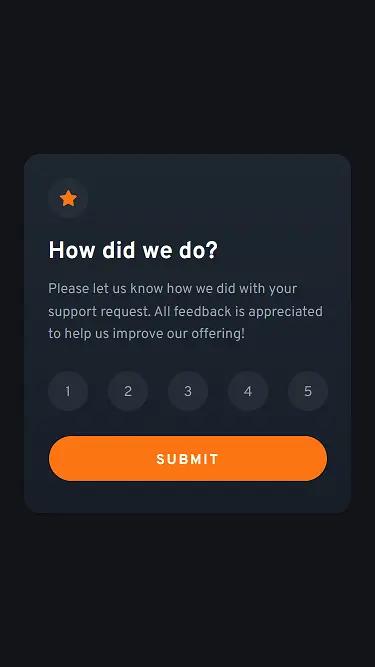

# Frontend Mentor - Interactive rating component solution

This is a solution to the [Interactive rating component challenge on Frontend Mentor](https://www.frontendmentor.io/challenges/interactive-rating-component-koxpeBUmI). Frontend Mentor challenges help you improve your coding skills by building realistic projects.

## Table of contents

- [Overview](#overview)
  - [The challenge](#the-challenge)
  - [Screenshot](#screenshot)
  - [Links](#links)
- [My process](#my-process)
  - [Built with](#built-with)
  - [Useful resources](#useful-resources)
- [Author](#author)

## Overview

### The challenge

Users should be able to:

- View the optimal layout for the app depending on their device's screen size
- See hover states for all interactive elements on the page
- Select and submit a number rating
- See the "Thank you" card state after submitting a rating

### Screenshot

### Links

- Solution URL: [click-me](https://github.com/OniOdd/interactive-rating-component)
- Live Site URL: [click-me](https://oniodd.github.io/interactive-rating-component)

## My process

### Built with

- Semantic HTML5 markup
- CSS custom properties
- Flexbox
- Mobile-first workflow
- TypeScript
- React
- BEM
- Vite

### Useful resources

- [MDN Web Docs](https://developer.mozilla.org/) - A useful informative resource.
- [Code Guide](https://codeguide.co/) - Standards for developing consistent, flexible, and sustainable HTML and CSS.
- [w3schools](https://www.w3schools.com/) - The world's largest web developer site.

## Author

- LinkedIn - [Mykyta Kavetskyi](https://www.linkedin.com/in/mykyta-kavetskyi/)
- Facebook - [Mykyta Kavetskyi](https://www.facebook.com/profile.php?id=100094490807763)
- Twitter - [@OniOdd](https://twitter.com/OniOdd)
- Frontend Mentor - [@OniOdd](https://www.frontendmentor.io/profile/OniOdd)
